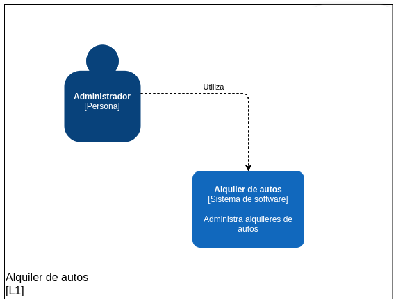

# Alquiler de autos

Aplicacion de backoffice que permite realizar reservaciones de autos, así como ver, crear, editar y eliminar información de los autos y clientes.

## Como correr localmente

Para ejecutar la aplicación de forma local, sigue los siguientes pasos:

- Clona el repositorio.
- En la carpeta del proyecto, ejecuta `npm i` para instalar las dependencias.
- Copiar el contenido de `.env.dist` a un nuevo archivo llamado `.env`
- Ejecuta `npm run db:migrate` para migrar la base de datos.
- Ejecuta `npm run start:dev` para iniciar el servidor.
- Abrir en el navegador http://localhost:3000/ para ver la aplicacion.

## Estructura de la aplicacion

La arquitectura de diseño de la aplicación se basa en el modelo MVC y sigue un enfoque similar al de Nest.js. La aplicación está dividida en diferentes módulos, donde cada uno tiene una responsabilidad específica.

Cada módulo cuenta con un controlador, que se encarga de gestionar las solicitudes HTTP y de renderizar las vistas. El controlador se comunica con el servicio, que se encarga de la lógica de negocios de la aplicación. Y el servicio a su vez utiliza un repositorio, que se encarga de hacer llamadas al ORM para interactuar con la base de datos.

## Diagramas C4

Se incluyen los siguientes diagramas para mostrar la arquitectura de la aplicacion:

